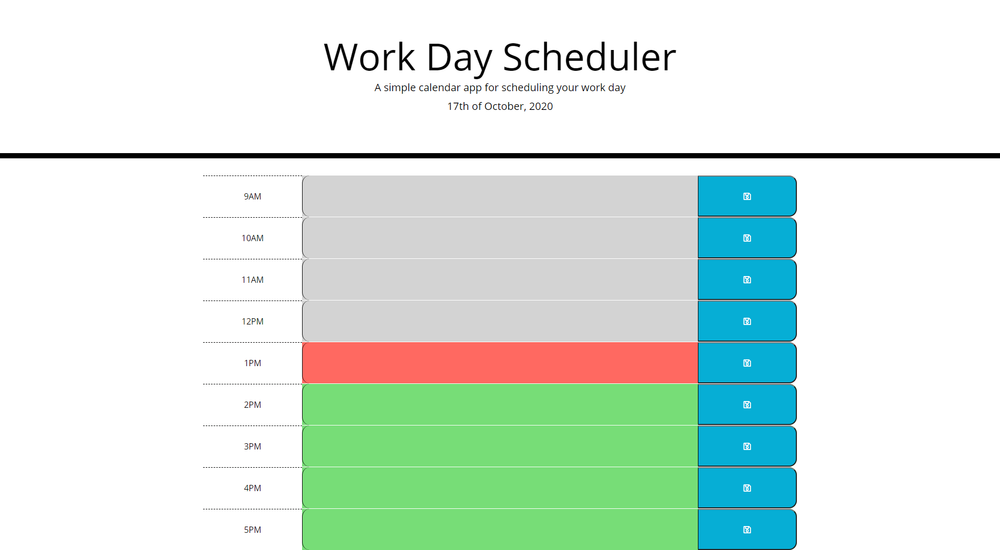

# Tuck-Work-Day-Scheduler README

## Requirements
* Build a simple calendar application
* This app will run in the browser
* Features dynamically updated HTML and CSS powered by jQuery
* Use the Moment.js library
* Have a clean, polished, and responsive user interface
* Display current day at the top of the calendar
* Time blocks for standard business hours
* Color code the time blocks for past, present, or future
* Enter events by clicking on the time block
* Save button saves to local storage
* Events must be persitant

## Files & directories

* index&#46;html

* script&#46;js

* style&#46;css

* README&#46;md

## Links

#####[Link to webpage](https://jamesjtuckbc.github.io/Tuck-Work-Day-Scheduler/)
#####[Link to repo](https://github.com/jamesjtuckbc/Tuck-Work-Day-Scheduler)
### Pages

#### index.html

- - -

© 2020 Jorgen Tuck
